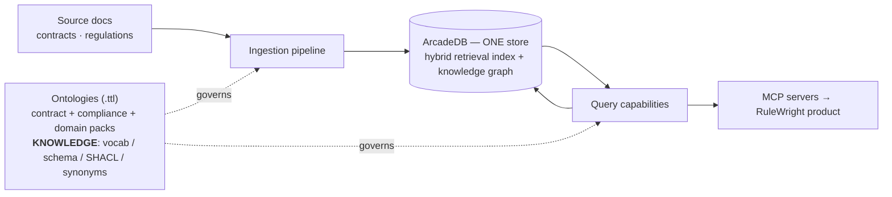
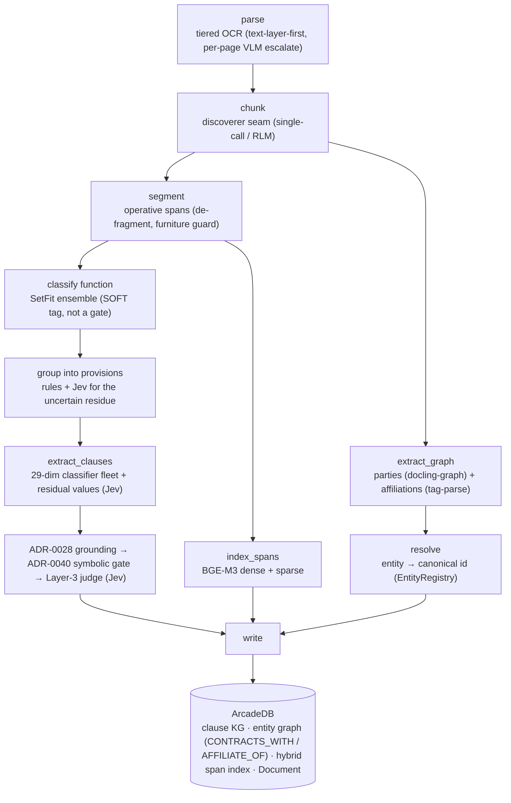
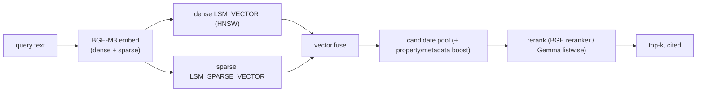
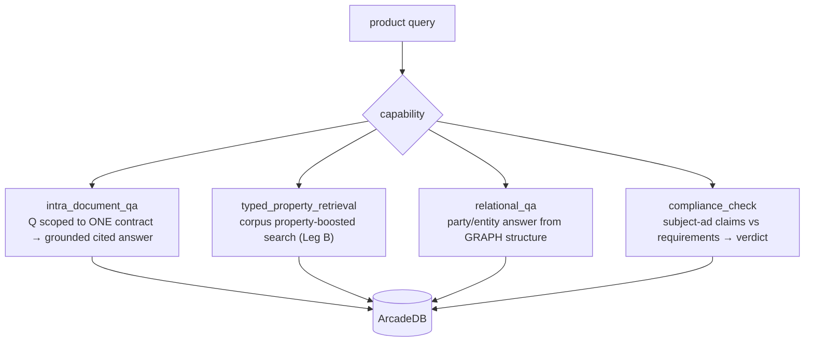
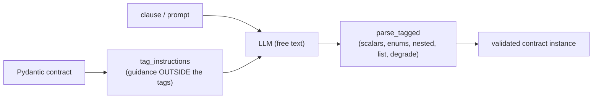

# RAG_Wright engine — architecture overview (current state)

Date: 2026-09-05; sections 3, 4, 6, 7 and 8 updated as of 2026-10-07 (shared ingestion stages, ADR-0124; the
classifier-first clause extraction with the Jev decision model; the neutral default schema; one product LLM).
A brief, grounded picture of how the engine works *right now*: the ingestion and query
pipelines (contracts + compliance), the role of the ontologies, how the knowledge graph (KG) is populated and
searched, how tag-parse works, the model defaults, and which registry capabilities are actually wired.

> This repo is the **engine** (open-core). The **product** (RuleWright) is a separate repo that depends on it and
> calls the engine through `rag_wright.api` (and, optionally, its MCP capabilities) (ADR-0052). This page describes
> the reference contract/compliance pack; a new domain ingests through the generic `build_ingestion` builder
> instead (see `concepts.md`).

---

## 1. System at a glance

Two standing principles shape everything:
- **One store (FR-S.1):** ArcadeDB holds *both* the hybrid retrieval index and the graph — no cross-store join.
- **Ontology = source of truth for KNOWLEDGE; code = MECHANISM (ADR-0066).** Vocab, schema, SHACL constraints,
  and synonyms live in `.ttl`; Python holds only behavior (pipelines, gates, parsers) + the prompt overlay.

---

## 2. Ontologies (the knowledge layer)

| file | role |
|---|---|
| `packs/contracts/ontology/contract_bridge.ttl` | contract clause KG: classes, dimensions, closed value sets, SHACL shapes, field "look-for" definitions (FOLIO + ODRL + PROV-O bridge) |
| `packs/compliance/ontology/compliance_bridge.ttl` | compliance/requirements schema (deontic types, actors, scope) |
| `packs/compliance/ontology/packs/ftc_16cfr255.ttl` | a **domain pack** — FTC 16 CFR 255 (endorsement) requirements. New customer domains are new `.ttl` packs, not engine edits |

The ttl is generated into Python (`scripts/generate_contract_python.py` → `_generated_vocab.py`,
`_generated_template_meta.py`) with CI enforcing zero drift (ADR-0066 Rule 2). The extraction template's field
descriptions/examples — the text the LLM actually reads — come from the ttl this way.

---

## 3. Ingestion pipeline (contracts)

`contract_ingestion_pipeline` (reference pack), a LangGraph on `scaffold.py` (dead-letter on hard failure; lossless
PARTIAL on per-clause loss). Since ING-4c its stages are the engine's shared `IngestionStages` (the same ones
`build_ingestion` uses), configured with legal hooks: the legal segmenter, the function span tagger, the provision
grouper with the Jev boundary decider, and the clause extractor and writer.

- **Clause extraction is classifier-first** (ADR-0115/0116): the extraction unit is a provision. A fleet of 29
  trained classifiers (SetFit / Laya, run locally) fills the closed-vocabulary dimensions, soft-scoped to the
  provision's top-3 function tags. The 7 numeric/open dimensions come from deterministic candidate phrases plus
  one Jev decision-model call per provision. The Layer-3 semantic judge is also Jev, one batched call per
  provision. So with a decision model available there is no per-provision LLM call;
  `RAG_RESIDUAL_EXTRACTOR=llm` / `RAG_SEMANTIC_JUDGE=llm` move those two steps back to the LLM.
- **Provision boundaries** are decided by rules for the clear majority; the uncertain residue goes to one batched
  Jev call per document with a structural rubric (cached; with no decision model it folds in).
- **Every graph fact carries provenance + confidence** (FR-S.4); grounding downgrades unverified values to
  `AMBIGUOUS` (kept, down-weighted); the symbolic gate flags intra-clause contradictions (function-independent).

### Compliance ingestion
`packs/compliance/subgraphs/compliance_ingestion.py` + `requirement_extraction.py` ingest a regulation/policy into typed
**requirements** (deontic type / actor / scope), guided by the compliance ontology + pack. Same parse→segment
front-end; the output is the requirement side the compliance check scores against.

---

## 4. The knowledge graph & how it's searched

`store/arcadedb.py`. One ArcadeDB database holds:
- **Graph**: `Clause` property records + `PropertyValue` nodes with typed property edges, `Contract` metadata,
  entities (parties) linked by `Relationship` edges typed `CONTRACTS_WITH` / `AFFILIATE_OF` (`PARTY_TO` was
  retired, ADR-0091), clause-to-clause `IsExceptionTo` edges, and one `Document` node per ingested document (child
  documents linked by `EmbeddedIn` / `AttachedTo`).
- **Schema:** a new database gets only the neutral engine types (`Chunk`, `Entity`, `Span`, `Document`,
  `Relationship`, `Mentions`, `EmbeddedIn`, `AttachedTo`); the contract types are ensured by `ContractKGStore` from
  `contract_bridge.ttl` on first use.
- **Hybrid index** on `Chunk` and `Span`: a **dense** `LSM_VECTOR` (HNSW) over the BGE-M3 summary vector **and**
  a **sparse** `LSM_SPARSE_VECTOR` over the full-text vector.

Population: `ContractKGStore.write_clause_kg` (clause assertions) and `ContractKGStore.upsert_contract` (the
reference pack's contract store), `write_graph` (entities + edges), `upsert_span`, and the generic `kg_write`
(typed `KgNode`/`KgEdge` records, what `build_ingestion`'s default writer uses). Search: `hybrid_search` / `span_hybrid_search` (dense+sparse fuse + boost + rerank) and
`graph_neighbors` / `_query` for structural traversal. No claim without a citation (FR-Q.6).

---

## 5. Query capabilities (the 4 MCP Tier-1 surfaces)

Each is a hardened LangGraph subgraph, registered and exposed as an MCP server the product calls.

| capability | subgraph | what it does |
|---|---|---|
| `intra_document_qa` | `packs/contracts/subgraphs/intra_document_qa.py` | scoped retrieval within one contract → answer generation with citations |
| `typed_property_retrieval` | `packs/contracts/subgraphs/typed_property_retrieval.py` | whole-index BGE pool + property boost + rerank (function is a soft boost, not a filter — ADR-0047) |
| `relational_qa` | `packs/contracts/subgraphs/relational_qa.py` | builds the answer from graph structure (parties/edges) |
| `compliance_check` | `packs/compliance/subgraphs/compliance_check.py` | extract the subject's claims → match against typed requirements (deontic-aware) → cited verdict |

---

## 6. tag-parse (the LLM-agnostic structured-output mechanism, ADR-0045)

Used on **both sides**. Instead of server-side JSON/guided decoding (not portable, breaks on legal prose), the
model answers in free text with light `<field>value</field>` tags that we parse **client-side** into the Pydantic
contract, with bounded re-ask.

- **Query side:** generation, query understanding, the semantic/reader judges (`models/tag_structured.py`).
- **Ingestion side (ADR-0080/0081):** the chunker's over-cap section refinement, affiliation extraction, and the LLM fallbacks of clause
  extraction (the residual values and the judge, when no decision model is used). The thematic-group passes and
  cross-model list union are no longer on the default path (clause extraction is classifier-first).

---

## 7. Model defaults

Routed through the **model-profile seam** (`models/profiles.py`, `models/seam.py`) — never a hardcoded provider
flag. `RAG_SERVING` selects backend (`openrouter` default / `vllm` self-hosted).

| role | model |
|---|---|
| every `ModelRole` (structured-reasoning and its secondary, general, summarization, OKF enrichment, function-classify, vision OCR) | **Qwen3.8-27B**, profile `qwen3.8-27b-modal-or` (OpenRouter today; it accepts images, so one served model covers OCR too) |
| typed decisions (`jev_decision`): provision boundaries, the ingest judge, the residual values | **Jev**, `DecisionModelProfile` `jev-1.13` (`RAG_DECISION_MODEL` overrides) |
| clause functions / closed-vocab properties | local trained classifiers (SetFit ensemble; 29-dim SetFit/Laya fleet) |

Override one role with `RAG_MODEL_<ROLE>`, every role with `RAG_MODEL_ALL`. The old list-union knobs
(`RAG_INGEST_LIST_MODEL`, `RAG_INGEST_CLAUSE_SAMPLES`, `RAG_INGEST_CLAUSE_EXTRACTOR`) are read only by the contracts
pack's legacy tag-parse extractor, which the default path does not use. See ADR-0100/0110 (product LLM routing and serving), ADR-0119 (decision model), ADR-0115 (classifier-first).

---

## 8. Registry & capabilities actually used

Two registries:
- `capabilities/registry.py` — a built capability is registered under a canonical slug **and** emits an
  **ARD** manifest skeleton (`urn:air:…`) for global discoverability (ADR-0052; ARD is standing, GraphWright is
  parked). The canonical slugs are the engine's 11 (`ENGINE_CAPABILITY_SLUGS`) plus each loaded pack's own
  (added with `register_canonical_slugs`; the reference pack adds its slugs when `load_reference_pack()` runs).
- `ontology/registry.py` — the domain-neutral `EntityRegistry` used by entity resolution. The API path
  (`ainvoke_subgraph("contract_ingestion_pipeline", ...)`) uses an empty closed-world registry, so parties stay
  unlinked unless matched; the CUAD bulk driver uses an EDGAR-verified registry (parties → EDGAR CIK).

**Capabilities wired in the current pipelines:**

| FR-C capability | where |
|---|---|
| Parsing (tiered OCR) | ingestion `parse` |
| Chunking (single-call / RLM discoverer) | ingestion `chunk` |
| Embedding (BGE-M3, dense+sparse) | `index_spans`, query |
| Hybrid search (dense+sparse fuse) | `hybrid_search` / `span_hybrid_search` |
| Reranking (BGE reranker / Gemma listwise) | query rerank stage |
| Graph extraction | clauses (classifier fleet + Jev residual values) + parties (docling-graph) + affiliations (tag-parse, only when a cue word is present) |
| Entity resolution | `resolve` (canonical id from the configured registry; EDGAR CIK for the CUAD corpus) |
| Ontology-driven schema/vocab | the `.ttl` layer (all stages) |
| Reasoning & generation | answer generation and the query-side judges (the product LLM, Qwen3.8-27B) |
| Typed decisions (`jev_decision`) | ingest provision boundaries, extraction judge, residual values |
| RLM skill | RLM chunking/synthesis (SKILL.md content) |

**Composite capabilities exposed to the product (MCP Tier-1):** `intra_document_qa`, `typed_property_retrieval`,
`relational_qa`, `compliance_check`. (`cross_corpus_retrieval` is retired — ADR-0043.)

---

## Pointers
ADRs `docs/adr/` (esp. 0033 unified KG, 0045 tag-parse, 0052 engine/product, 0066 ontology-as-truth,
0079–0082 the earlier ingestion arc; 0115 classifier-first extraction, 0119 the Jev decision model, 0124 the generic
ingestion builder and hooks). Ledger: `tasks.md`; current workstream: `docs/specs/ingestion-hooks/plan.md`. Handoff: `docs/archive/handoffs/2026-09-05_tagparse-ingestion-and-granite-4.2_rulewright.md`.
