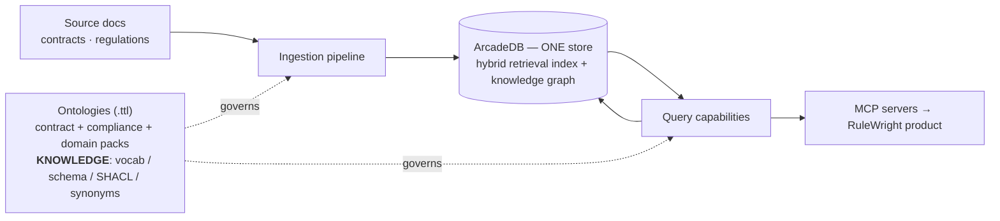
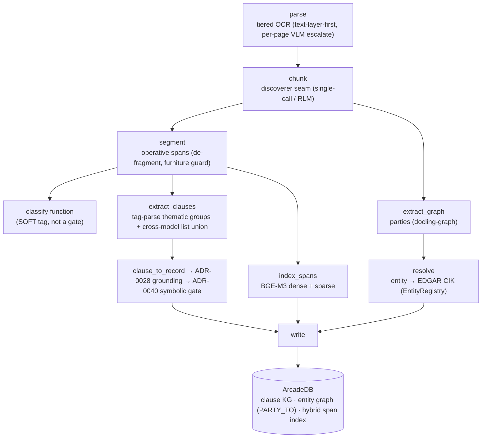
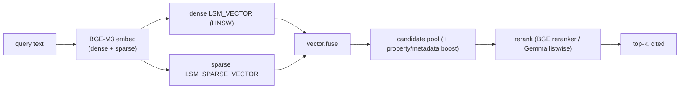
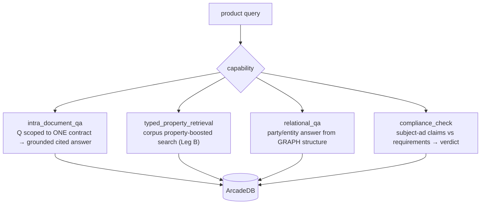
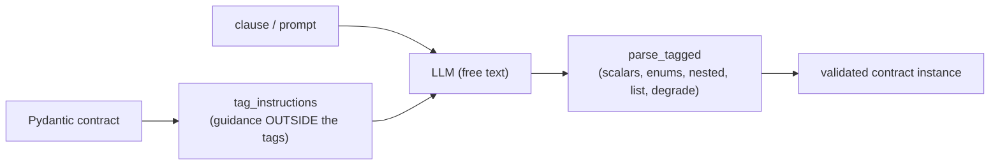

# RAG_Wright engine — architecture overview (current state)

Date: 2026-09-05. A brief, grounded picture of how the engine works *right now*: the ingestion and query
pipelines (contracts + compliance), the role of the ontologies, how the knowledge graph (KG) is populated and
searched, how tag-parse works, the model defaults, and which registry capabilities are actually wired.

> This repo is the **engine** (open-core). The **product** (RuleWright) is a separate repo that depends on it and
> calls the engine's MCP capabilities (ADR-0052).

---

## 1. System at a glance

Two standing principles shape everything:
- **One store (FR-S.1):** ArcadeDB holds *both* the hybrid retrieval index and the graph — no cross-store join.
- **Ontology = source of truth for KNOWLEDGE; code = MECHANISM (ADR-0066).** Vocab, schema, SHACL constraints,
  and synonyms live in `.ttl`; Python holds only behavior (pipelines, gates, parsers) + the prompt overlay.

---

## 2. Ontologies (the knowledge layer)

| file | role |
|---|---|
| `ontology/contract_bridge.ttl` | contract clause KG: classes, dimensions, closed value sets, SHACL shapes, field "look-for" definitions (FOLIO + ODRL + PROV-O bridge) |
| `ontology/compliance_bridge.ttl` | compliance/requirements schema (deontic types, actors, scope) |
| `ontology/packs/ftc_16cfr255.ttl` | a **domain pack** — FTC 16 CFR 255 (endorsement) requirements. New customer domains are new `.ttl` packs, not engine edits |

The ttl is generated into Python (`scripts/generate_contract_python.py` → `_generated_vocab.py`,
`_generated_template_meta.py`) with CI enforcing zero drift (ADR-0066 Rule 2). The extraction template's field
descriptions/examples — the text the LLM actually reads — come from the ttl this way.

---

## 3. Ingestion pipeline (contracts)

`subgraphs/contract_ingestion_pipeline.py`, a LangGraph on `scaffold.py` (dead-letter on hard failure; lossless
PARTIAL on per-clause loss).

- **Clause extraction is function-INDEPENDENT** (ADR-0081): the 35-field `Clause` is split into ~8 thematic
  groups, each extracted by tag-parse; list-bearing groups also run a second model and UNION the lists.
- **Every graph fact carries provenance + confidence** (FR-S.4); grounding downgrades unverified values to
  `AMBIGUOUS` (kept, down-weighted); the symbolic gate flags intra-clause contradictions (function-independent).

### Compliance ingestion
`subgraphs/compliance_ingestion.py` + `requirement_extraction.py` ingest a regulation/policy into typed
**requirements** (deontic type / actor / scope), guided by the compliance ontology + pack. Same parse→segment
front-end; the output is the requirement side the compliance check scores against.

---

## 4. The knowledge graph & how it's searched

`store/arcadedb.py`. One ArcadeDB database holds:
- **Graph**: `Clause` property records, entities (parties), `PARTY_TO` and clause-relationship edges.
- **Hybrid index** on `Chunk` and `Span`: a **dense** `LSM_VECTOR` (HNSW) over the BGE-M3 summary vector **and**
  a **sparse** `LSM_SPARSE_VECTOR` over the full-text vector.

Population: `write_clause_kg` (clause assertions), `write_graph` (entities + edges), `upsert_span` /
`upsert_contract`. Search: `hybrid_search` / `span_hybrid_search` (dense+sparse fuse + boost + rerank) and
`graph_neighbors` / `_query` for structural traversal. No claim without a citation (FR-Q.6).

---

## 5. Query capabilities (the 4 MCP Tier-1 surfaces)

Each is a hardened LangGraph subgraph, registered and exposed as an MCP server the product calls.

| capability | subgraph | what it does |
|---|---|---|
| `intra_document_qa` | `subgraphs/intra_document_qa.py` | scoped retrieval within one contract → answer generation with citations |
| `typed_property_retrieval` | `subgraphs/typed_property_retrieval.py` | whole-index BGE pool + property boost + rerank (function is a soft boost, not a filter — ADR-0047) |
| `relational_qa` | `subgraphs/relational_qa.py` | builds the answer from graph structure (parties/edges) |
| `compliance_check` | `subgraphs/compliance_check.py` | extract the subject's claims → match against typed requirements (deontic-aware) → cited verdict |

---

## 6. tag-parse (the LLM-agnostic structured-output mechanism, ADR-0045)

Used on **both sides**. Instead of server-side JSON/guided decoding (not portable, breaks on legal prose), the
model answers in free text with light `<field>value</field>` tags that we parse **client-side** into the Pydantic
contract, with bounded re-ask.

- **Query side:** generation, query understanding, the semantic/reader judges (`models/tag_structured.py`).
- **Ingestion side (new, ADR-0080/0081):** clause extraction — nested-schema support, re-ask-then-omit-to-default
  degrade, thematic-group passes, and cross-model list union.

---

## 7. Model defaults

Routed through the **model-profile seam** (`models/profiles.py`, `models/seam.py`) — never a hardcoded provider
flag. `RAG_SERVING` selects backend (`openrouter` default / `vllm` self-hosted).

| role | model |
|---|---|
| all text roles (structured-reasoning, general, summarization, function-classify, …) | **`ibm-granite/granite-4.2-8b`** |
| vision OCR | `google/gemma-4-31b-it` |
| ingestion cross-model list union (list-bearing groups only) | `google/gemma-4-31b-it` (configurable / `off`) |

Ingestion clause-extraction knobs: `RAG_INGEST_CLAUSE_EXTRACTOR` (`tagparse` default | `docling`),
`RAG_INGEST_LIST_MODEL` (default gemma | `off`), `RAG_INGEST_CLAUSE_SAMPLES` (default 1), `RAG_INGEST_CLAUSE_GATE`
(default off). See ADR-0079/0081.

---

## 8. Registry & capabilities actually used

Two registries:
- `capabilities/registry.py` — a built capability is registered under its FR-C/FR-I/FR-Q name **and** emits an
  **ARD** manifest skeleton (`urn:air:…`) for global discoverability (ADR-0052; ARD is standing, GraphWright is
  parked).
- `ontology/registry.py` — the `EntityRegistry` used by entity resolution (parties → EDGAR CIK).

**Capabilities wired in the current pipelines:**

| FR-C capability | where |
|---|---|
| Parsing (tiered OCR) | ingestion `parse` |
| Chunking (single-call / RLM discoverer) | ingestion `chunk` |
| Embedding (BGE-M3, dense+sparse) | `index_spans`, query |
| Hybrid search (dense+sparse fuse) | `hybrid_search` / `span_hybrid_search` |
| Reranking (BGE reranker / Gemma listwise) | query rerank stage |
| Graph extraction | clauses (tag-parse) + parties (docling-graph) |
| Entity resolution | `resolve` (EDGAR CIK) |
| Ontology-driven schema/vocab | the `.ttl` layer (all stages) |
| Reasoning & generation | answer generation, judges (granite-4.2) |
| RLM skill | RLM chunking/synthesis (SKILL.md content) |

**Composite capabilities exposed to the product (MCP Tier-1):** `intra_document_qa`, `typed_property_retrieval`,
`relational_qa`, `compliance_check`. (`cross_corpus_retrieval` is retired — ADR-0043.)

---

## Pointers
ADRs `docs/adr/` (esp. 0033 unified KG, 0045 tag-parse, 0052 engine/product, 0066 ontology-as-truth,
0079–0082 the current ingestion arc). Ledger: `tasks.md`. Handoff: `docs/handoff/2026-09-05_tagparse-ingestion-and-granite-4.2_rulewright.md`.
